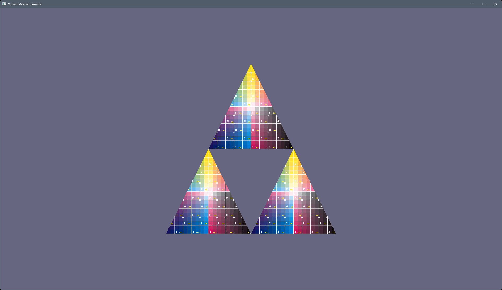

# Vulkan 1.3 Minimal Example
---

Aim of this project is to create a purely minimal example of using Vulkan-Hpp, Vulkan Memory Allocator,
vk-bootstrap and glm.

It does not use any "framework" style scaffolding.

## Project Setup
Project uses CMake `3.31.x`, Ninja `1.12.1` and VCPKG, for a cross-platform build (Windows and Linux)
`C++23` support is required, including C++ Modules.
Vulkan SDK is at `1.4.304`, which was latest available SDK, and vk-bootstrap is at `1.4.304`.

For Linux build, it requires LLVM/Clang version `18.1.x` or better.
For Windows build, it requires MSVC version `17.10.x` or better.

There are two presets in the config, one for windows and one for linux.
Both builds assume Vulkan sdk is setup correctly.

For few of the dependencies VCPKG overlays are being used as these either don't exist in VCPKG's port repo or version in their repo was/is outdated.

### Dependencies
- [Vulkan SDK](https://vulkan.lunarg.com) `1.3.296`
- [DXC](https://github.com/Microsoft/DirectXShaderCompiler/wiki/SPIR%E2%80%90V-CodeGen) `1.8`, HLSL shader compiler bundled in Vulkan SDK
- [VK-Bootstrap](https://github.com/charles-lunarg/vk-bootstrap) `1.3.298`, retrived via vcpkg overlay from vk-bootstrap github.
- [Vulkan Memory Allocator](https://github.com/GPUOpen-LibrariesAndSDKs/VulkanMemoryAllocator) `3.1`, used by VMA-HPP
- [Vulkan Memory Allocator HPP](https://github.com/YaaZ/VulkanMemoryAllocator-Hpp) `3.1`
- [GLM](https://github.com/g-truc/glm) `1.0.1`
- [GLFW](https://www.glfw.org/) `3.4`
- [dds-ktx](https://github.com/septag/dds-ktx) `latest`, retrived via vcpkg overlay from dds-ktx github

## Code Layout
All the code is in `vk-min-src.cpp` file. 
Have made best effort to document/comment how it's being used.

## Vulkan features used
- Viewport height negative, to get +X right, +Y up, +Z into screen (LHS)
- Dynamic Rendering
- Shader Device Address
- Descriptor Buffers
  - Uniform buffer
  - Texture buffer, image + sampler

## References
- https://github.com/KhronosGroup/Vulkan-Samples/tree/main/samples/extensions/descriptor_buffer_basic
- https://github.com/steps3d/vulkan-with-classes/blob/main/example-descriptor-buffer.cpp
- https://docs.vulkan.org/features/latest/features/proposals/VK_EXT_descriptor_buffer.html
- https://www.khronos.org/blog/vk-ext-descriptor-buffer

## Screenshot

